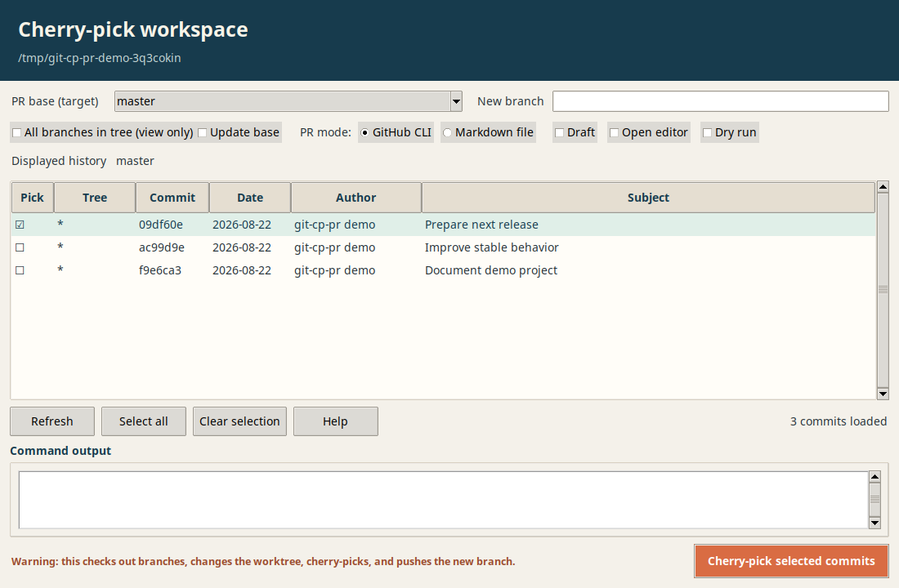
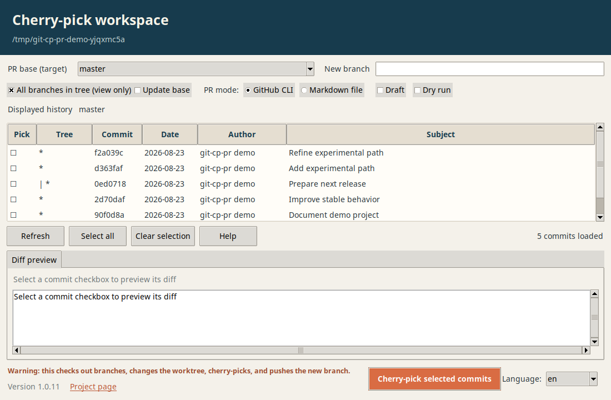

# Git Cherry-Pick PR tool

An automated Python tool to cherry-pick specific commits or commit ranges, 
create a feature branch, and generate a structured Pull Request (PR) automatically. 

## What does it do ?

- **Cherry-picking:** Cherry-picks single commits or ranges (`A..B`) into a new branch.
- **Commit Formatting:**
  - Extracts and merges `Co-authored-by` and `Signed-off-by` trailers.
  - Cleans up inner Markdown
  - Uses original commit messages (subject/body) for single commits or structured templates for multiple commits.
- **Optionally:**
  - Updates the base branch before picking.
  - Choice between direct GitHub PR creation (`gh`) or generating a structured `.md` file.
  - Creates draft pull requests with `--draft`.
  - Opens the configured editor before GitHub CLI submission with `--editor` (or `--edit`).
  - Applies commits to the cherry-pick branch without pushing or creating a PR, with `--dry-run`.

This is useful when your development branch contains many local commits but you
need to send only one or more specific changes upstream. For example, a bug
fix discovered during development can be selected from the same branch,
cherry-picked onto a clean temporary branch, and submitted as a focused pull
request without including unrelated work.

## Prerequisites

- Python 3.6+
- Git
- [GitHub CLI (`gh`)](https://cli.github.com/) (Optional, used for direct PR creation)
- Tkinter (required only for the optional GUI; on Ubuntu/Debian install `python3-tk`)

## Installation

For a globally available command-line application, use **pipx**. It keeps the
application isolated from the system Python and avoids externally managed
Python restrictions. The recommended installation pulls the tool directly from
GitHub.

On Ubuntu or Debian:

```bash
sudo apt update
sudo apt install pipx
pipx ensurepath
pipx install git+https://github.com/jplcz/git-cp-pr.git
```

On macOS with Homebrew:

```bash
brew install pipx
pipx ensurepath
pipx install git+https://github.com/jplcz/git-cp-pr.git
```

On BSD, install `pipx` using the operating system's package manager, then run:

```bash
pipx ensurepath
pipx install git+https://github.com/jplcz/git-cp-pr.git
```

On Windows PowerShell:

```powershell
py -m pip install --user pipx
py -m pipx ensurepath
pipx install git+https://github.com/jplcz/git-cp-pr.git
```

Open a new terminal after `ensurepath` if the `pipx` command is not found.

To install from a local checkout instead, clone the repository and install it
from that directory:

```bash
git clone https://github.com/jplcz/git-cp-pr.git
cd git-cp-pr
pipx install .
```

On Windows PowerShell, use the same `git clone`, `cd`, and `pipx install .`
commands.

For development or a project-local installation, use a virtual environment.
This also works on systems where `pipx` is unavailable.

On macOS or Linux:

```bash
python3 -m venv .venv
source .venv/bin/activate
python -m pip install --upgrade pip
python -m pip install -e .
```

On Windows PowerShell:

```powershell
py -m venv .venv
.\.venv\Scripts\Activate.ps1
python -m pip install --upgrade pip
python -m pip install -e .
```

## Upgrade

From the project directory, first update the source code:

```bash
git pull
```

For an installation created directly from GitHub, reinstall from the updated
repository:

```bash
pipx install --force git+https://github.com/jplcz/git-cp-pr.git
```

For an installation created from a local checkout, run `pipx install --force .`
from that checkout.

If the package was installed from a package index instead, use:

```bash
pipx upgrade git-cp-pr
```

For a virtual environment installation, activate the existing environment and
install the updated project:

```bash
python -m pip install --upgrade -e .
```

## Git Integration

After installation, Git can discover the console scripts as external commands:

```bash
git cp-pr abc1234
git cp-pr-gui
```

Git resolves `git cp-pr` to the `git-cp-pr` executable and `git cp-pr-gui` to
`git-cp-pr-gui`. Make sure the directory containing the installed scripts is on
your `PATH` (`pipx ensurepath` handles this for pipx installations).

## Graphical Interface

The optional cross-platform Tkinter frontend displays the Git commit graph and
allows commits to be selected with checkboxes before running the normal CLI
workflow:

```bash
cd /path/to/target/repository
git-cp-pr-gui
```

The GUI uses the directory where it is launched as the target Git repository;
it does not use the repository containing the installed application.

The GUI exposes the base branch, custom branch name, base update, PR mode,
draft, editor, and commit-history scope options. By default it displays the
checked-out branch; enable **All branches in tree** to view commits from the
local and remote branches shown in the Git tree. This only expands the commits
available for selection; it does not select or add any commits to the
cherry-pick. It invokes
`git-cp-pr`'s existing Python workflow, so command-line and GUI behavior remain
consistent.

The PR base target defaults to `master` when present, otherwise `main`, and is
independent from the displayed history.

### Screenshots

Current-branch view:



All-branches view:



## Examples

Cherry-pick a single commit to `master`:

```bash
git-cp-pr abc1234
```

Cherry-pick a range to `main` and output a Markdown file:

```bash
git-cp-pr -b main --mode md abc1234..def5678
```

Create a draft pull request and edit its title and body before submitting:

```bash
git-cp-pr --draft --editor abc1234
```

Apply commits to the cherry-pick branch without pushing it or creating a PR:

```bash
git-cp-pr --dry-run abc1234
```

## How It Works

* **Checkout:** Switches to the specified base branch.
* **Branching:** Creates a new temporary branch named cherry-pick-<hash>-<timestamp>.
* **Cherry-pick:** Applies the requested commits using Git's native logic.
* **Format:** The CommitFormatter class parses the commit bodies, cleans markdown, extracts trailers, and merges them.
* **Publish:** Creates a PR via gh or saves a pull_request_<timestamp>.md file.
* **Restore:** Returns to the original branch after the workflow. If cherry-picking fails or is cancelled, aborts the operation and removes the temporary branch.

## Contributing

Pull requests are welcome! If you encounter issues, please check that your git environment is clean before running the script.
